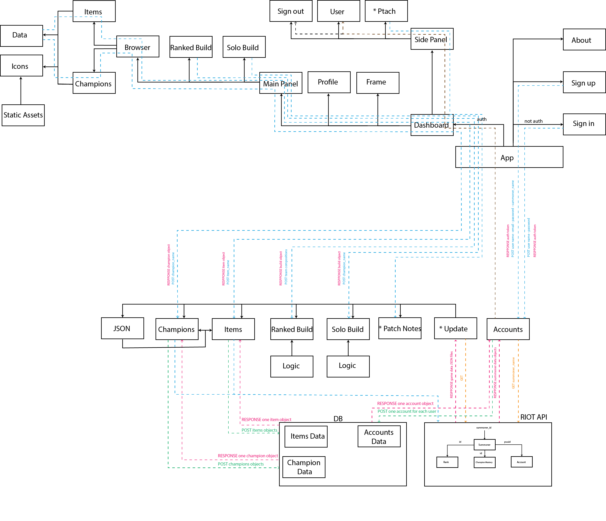
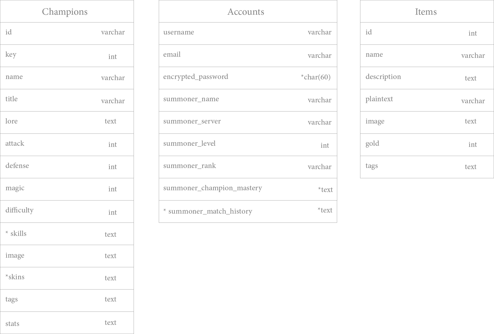

# League Advisor API

### We are deployed on *GitHub*

[League Advisor API](https://github.com/League-Advisor/league-advisor-api)

---

## API Server

### *TBA*

---

## Features and Tests

### *TBA*

---

## User Stories

[User Stories](https://github.com/orgs/League-Advisor/projects/2)

---

## Domain Model

- Items marked with * are stretch goals or may require different approach.

---

## Database Schema Diagram

- Items marked with * are stretch goals or may require different approach.

---

## Project Directory Tree

### *TBA*

---

## Tools Used

[GitHub Projects - League Advisor Web App](https://github.com/orgs/League-Advisor/projects/2)

- Python
- Poetry
- Django
- restframework
- Django-rest-framework
- Django-cors-headers
- pytz
- PyJWT
- DateTime
- bs4
- requests
- pandas
- cdifflib
- collections-extended
- django-nose
- coverage

---

## Getting Started

### *TBA*

---

## Change Log

v0.1: _feat: started project and created project repo_ - 08 Dec 2021

v0.1.1 _docs: added requirements, domain model and db schema_ - 08 Dec 2021

v0.1.2 _docs: edited domain model and db schema_ - 09 Dec 2021

v0.1.3 _feat: create django project and account app_ - 09 Dec 2021

v0.1.4 _feat: create account model_ - 10 Dec 2021

v0.2.0 _feat: created champions app_ - 10 Dec 2021

v0.2.1 _tests: added champions app tests_ - 10 Dec 2021

v0.2.3 _feat: created patch_notes app_ - 10 Dec 2021

v0.2.4 _tests: added patch_notes app tests_ - 10 Dec 2021

v0.2.5 _feat: modified champions command to include stretch goals_ - 11 Dec 2021

v0.1.5 _feat: create account register, login, logout and, user (views & serializers)_ - 10 Dec 2021

v0.1.6 _feat: fill out the account-model fields with riot-games-datasets_ - 11 Dec 2021

v0.1.7 _refactor: accounts-app api data refactor and adding env variables_ - 12 Dec 2021

v0.1.8 _fix: avoid errors on invalid summonername_ - 12 Dec 2021

v0.1.9 test:_ading account test file and test (views, model)_ - 12 Dec 2021

v0.2.6 _feat: automated detecting newer patch release and updating data_ - 11 Dec 2021

v0.2 _feat: create items app and some tests_ - 10 Dec 2021

v0.4.0 :_feat: created solo champion app and ranked app_ - 11 Dec 2021

v0.4.1 :_feat: refacring ranked app_ - 11 Dec 2021

v0.4.2 :_test: adding tests for solo champion_ - 12 Dec 2021

v0.4.3 :_test: make a test for ranked app_ - 12 Dec 2021

v0.5.0 :_refactor: automate populating items_ - 12 Dec 2021

v0.5.1 :_refactor: initial db population and automating version reading_ - 12 Dec 2021

v0.5.3 :_test: _update tests_ - 12 Dec 2021

v0.5.4 :_fix: added temporary alternative login/registration method_ - 13 Dec 2021

---

## Test Coverage

### *TBA*

---

## Authors

- Bashar Taamneh
- Du'a Jaradat
- Ehab Ahmad
- Mohammed Al-Hanbali
